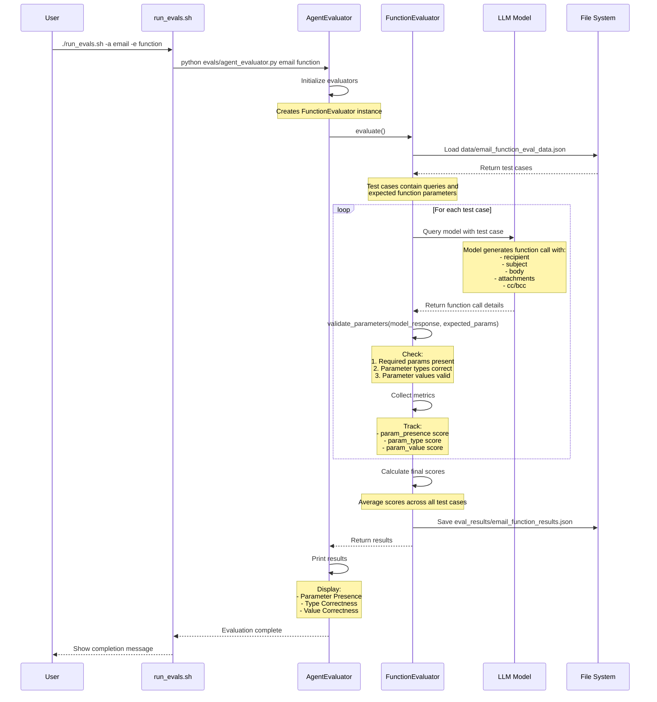

## Function Call Evaluation Flow

This diagram shows how we test the email agent's function call parameter handling:

1. User runs evaluation specifically for email agent's function calls
2. System loads test cases with expected parameter specifications
3. For each test case:
   - Send query to LLM model
   - Model generates email function call with parameters
   - Validate parameters against expectations:
     - Are required parameters (recipient, subject, body) present?
     - Are parameter types correct (e.g., array for cc/bcc)?
     - Are values valid (e.g., valid email format)?
4. Calculate scores for:
   - Parameter presence (completeness)
   - Type correctness (format)
   - Value validity (constraints)
5. Results show how well the model structures email function calls 