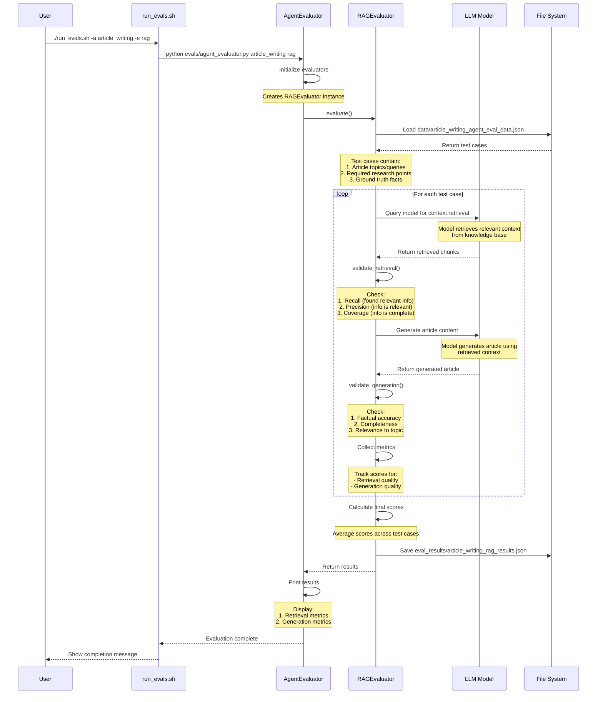

## RAG Evaluation Flow for Article Writing Agent

This diagram shows how we evaluate the article writing agent's RAG capabilities:

1. **Test Case Loading**:
   - Load test cases with article topics
   - Each case includes required research points and facts
   - Ground truth contains expected content and facts

2. **Retrieval Evaluation**:
   - Model retrieves relevant context
   - Evaluate if retrieved content:
     - Contains required information (recall)
     - Is relevant to topic (precision)
     - Covers all needed points (coverage)

3. **Generation Evaluation**:
   - Model generates article using context
   - Evaluate if generated article:
     - States facts correctly
     - Covers all required points
     - Stays relevant to topic

4. **Metrics Collection**:
   - Retrieval metrics:
     - Recall: Found relevant information
     - Precision: Information is relevant
     - Coverage: Information is complete
   - Generation metrics:
     - Factual accuracy
     - Completeness
     - Topic relevance

5. **Results**:
   - Save detailed metrics
   - Show retrieval and generation scores 