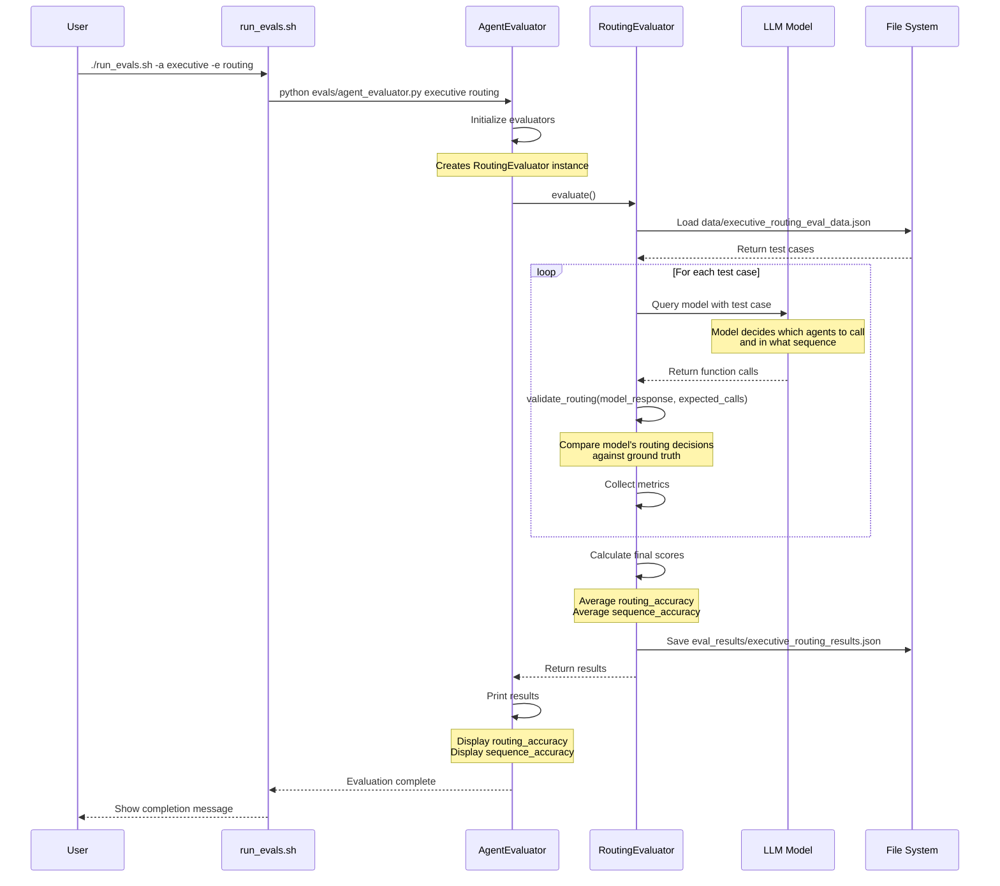

## Routing Evaluation Flow

This diagram shows how we test the model's routing decisions:

1. User runs the evaluation script
2. System loads test cases with known correct routings
3. For each test case:
   - Send the query to the actual LLM model
   - Model makes routing decisions (which agents to call)
   - Compare model's decisions against expected routing
4. Calculate how often the model:
   - Calls the correct set of agents (routing accuracy)
   - Calls them in the correct order (sequence accuracy)
5. Results show how well the model routes queries to agents 