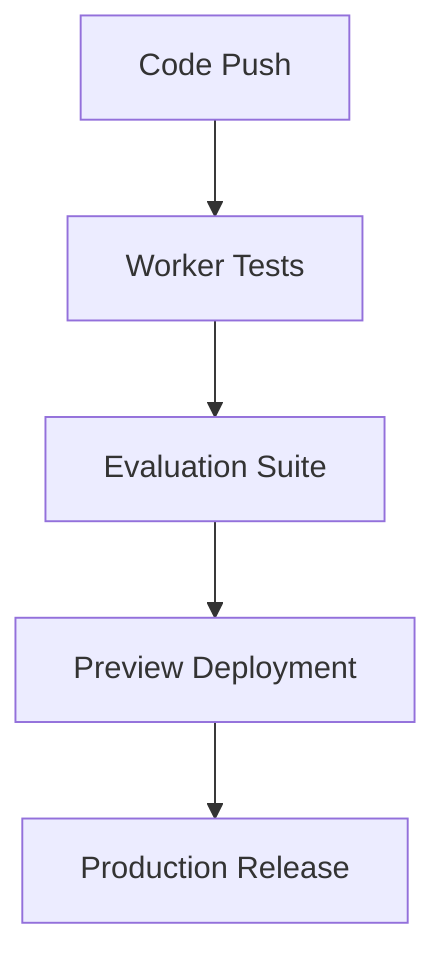

# RAG System Technical Architecture

## Overview
Edge-first RAG system leveraging Cloudflare's infrastructure for a serverless, globally distributed architecture. All components are designed for edge deployment, ensuring minimal latency and maximum scalability.

## Infrastructure Components

### Model Layer
1. **Model Serving**
   - **Cloudflare Workers AI**
     - Primary interface for model operations
     - Built-in request validation
     - Automatic scaling
     - Global model availability

   - **Mixtral 8x7B via Workers AI**
     - Inference endpoints:
       - /api/generate (completion)
       - /api/chat (chat completion)
       - /api/embed (embedding)
     - Use cases:
       - Main generation and reasoning
       - Synthetic data generation
       - Evaluation tasks

   - **BGE-large-en-v1.5 via Workers AI**
     - Embedding generation
     - Dimensionality: 1024
     - Context window: 512 tokens

2. **API Structure**
   ```typescript
   // Worker API definitions
   interface ModelWorker {
     generate: (input: GenerationInput) => Promise<WorkersAIResponse>;
     embed: (input: EmbeddingInput) => Promise<Float32Array>;
     chat: (input: ChatInput) => Promise<WorkersAIResponse>;
   }
   ```

### Data Storage Layer
1. **Vector Store**
   - Cloudflare Vectorize
   - Indexes: 
     - Primary document chunks
     - Query caching
   - Configuration:
     - Dimension: 1024 (matching BGE)
     - Metric: cosine similarity
     - Index type: HNSW

2. **Relational Storage**
   - Cloudflare D1
   - Schema managed by Drizzle ORM
   ```typescript
   // Core schemas
   interface DocumentMetadata {
     id: string;
     title: string;
     chunks: ChunkMetadata[];
     evaluationScores: EvalMetrics;
   }

   interface EvalMetrics {
     retrievalQuality: number;
     generationQuality: number;
     timestamp: Date;
   }
   ```

3. **Object Storage**
   - Cloudflare R2
   - Use cases:
     - Raw documents
     - Evaluation artifacts
     - Synthetic datasets

4. **Cache Layer**
   - Cloudflare KV
   - Real-time metrics
   - Query results
   - Embedding cache

## Application Architecture

### Edge Workers
1. **Query Processing Worker**
   ```typescript
   export default {
     async fetch(request: Request): Promise<Response> {
       const { query, options } = await request.json();
       
       // Embedding generation
       const embedding = await AI.embed(query);
       
       // Vector search
       const context = await vectorize.search(embedding);
       
       // Response generation
       const response = await AI.generate({
         context,
         query,
         options
       });

       return new Response(JSON.stringify(response));
     }
   };
   ```

2. **Document Processing Worker**
   ```typescript
   export default {
     async fetch(request: Request): Promise<Response> {
       const document = await request.blob();
       
       // Process document
       const chunks = await processDocument(document);
       
       // Generate embeddings
       const embeddings = await Promise.all(
         chunks.map(chunk => AI.embed(chunk))
       );

       // Store in Vectorize
       await vectorize.insert(embeddings);

       return new Response('Processing complete');
     }
   };
   ```

3. **Evaluation Worker**
   ```typescript
   export default {
     async fetch(request: Request): Promise<Response> {
       const { type, data } = await request.json();
       
       switch(type) {
         case 'retrieval':
           return evaluateRetrieval(data);
         case 'generation':
           return evaluateGeneration(data);
         case 'synthetic':
           return generateSyntheticData(data);
       }
     }
   };
   ```

### Frontend
- Next.js 14 App Router
- Cloudflare Pages deployment
- Server Components for:
  - Data fetching
  - Streaming responses
  - Real-time metrics

## Evaluation System

### Synthetic Data Generation
```typescript
interface SyntheticDataGeneration {
  worker: AI.WorkersAI;
  
  async generateContent(config: GenerationConfig): Promise<SyntheticData> {
    // Generate using Mixtral via Workers AI
    const content = await this.worker.generate({
      prompt: config.template,
      parameters: config.parameters
    });

    // Validate and store
    return this.processAndStore(content);
  }
}
```

### Evaluation Pipeline
1. **Retrieval Evaluation**
   - Context relevance scoring
   - Precision/recall metrics
   - Response time tracking

2. **Generation Evaluation**
   - Answer quality assessment
   - Source verification
   - Factual consistency

3. **System Metrics**
   - Edge latency tracking
   - Cache hit rates
   - Worker performance

## Development Environment

### Local Setup
```bash
# Start local development
wrangler dev --local

# Database operations
wrangler d1 execute DB --local

# Vector operations
wrangler vectorize execute STORE --local
```

### Deployment Pipeline


## System Constraints
- Workers execution limits
- KV entry size limits
- D1 query complexity
- R2 object size limits
- Workers AI rate limits

## Monitoring
1. **Real-time Metrics**
   - Worker execution stats
   - Model performance
   - Cache effectiveness

2. **Evaluation Metrics**
   - Retrieval quality
   - Generation accuracy
   - System performance

## Future Considerations
1. Multi-region optimization
2. Advanced caching strategies
3. Custom model deployment
4. Enhanced evaluation metrics
5. Auth implementation